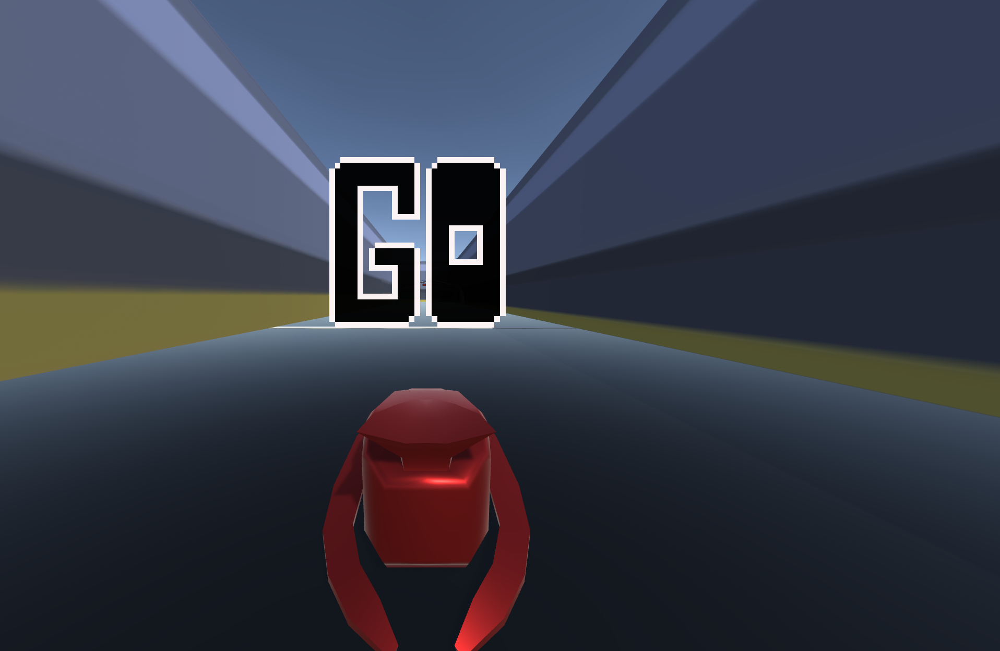
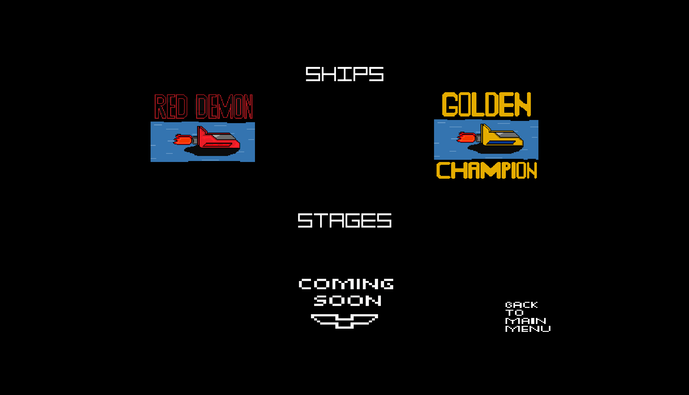
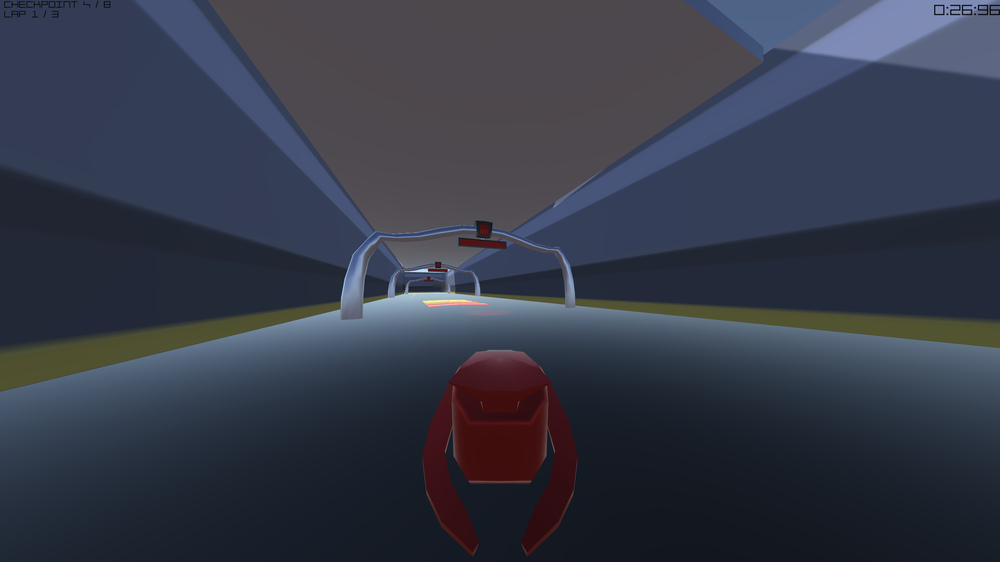
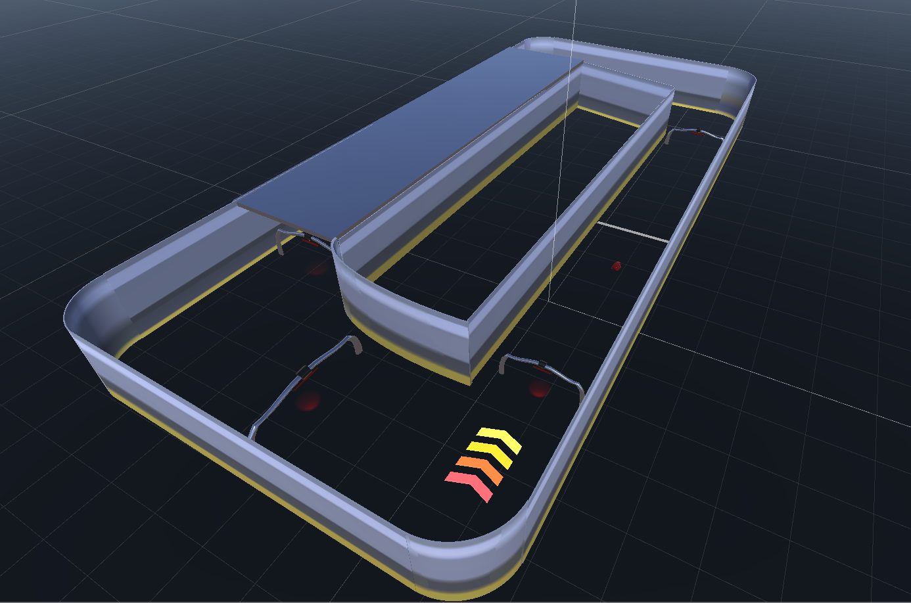

# NowThisIsPod

* This is my first bigger Unity project that i made for my school course. I am currently still updating it and developing it further.

## For full game:
* Check out the versioning
* Download the zip
* Extract the folder
* Open the NowThisIsPod.exe
* Enjoy!

## Versioning:
### Newest version
* [Version 1.0.2](https://github.com/MMIK0/NowThisIsPod/releases/tag/v1.0.3)

# Built using
* Visual Studio Code
* Unity

# Screenshots

